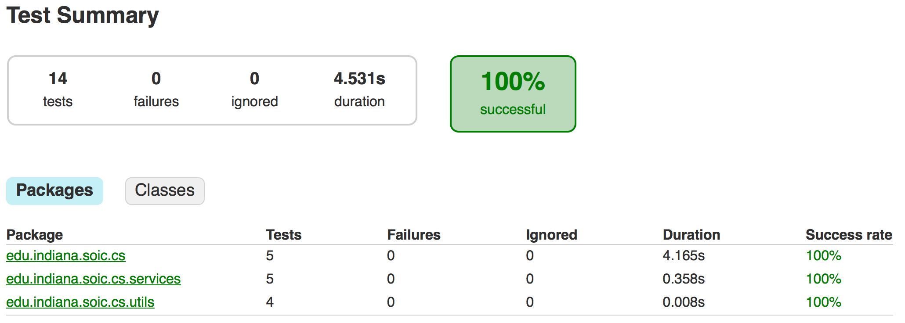
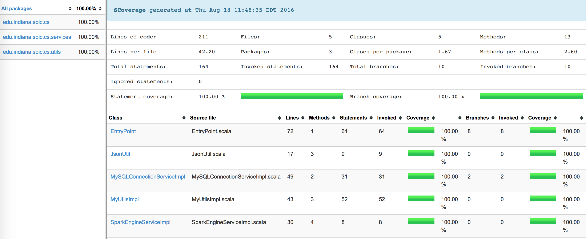

A demo project which will Read and Write a dataframe to MySQL DB. 

<br>

##Build System  ([Gradle](https://discuss.gradle.org/t/gradle-2-14-released/18040))

```gradle
------------------------------------------------------------
Essential tasks runnable from root project
------------------------------------------------------------

Build tasks
-----------
build - Assembles and tests this project.
clean - Deletes the build directory.
jar - Assembles a jar archive containing the main classes.

Help tasks
----------
tasks - Displays the tasks runnable from root project 'SparkReadWriteDF'.

IDE tasks
---------
cleanEclipse - Cleans all Eclipse files.
eclipse - Generates all Eclipse files.

Verification tasks
------------------
check - Runs all checks.
test - Runs the unit tests.

Other tasks
-----------
checkScoverage
jarScoverage
```

<br><br>

##Input Resources
- Common Resources

  - [record.json](resources/main/record.json) has JSON records which will be written to DB.
  - [dbArgs.json](resources/main/dbArgs.json) MySQL DB Connection Details are present here.
  - [sparkArgs.json](resources/main/sparkArgs.json) Spark Engine Configuration Details are present here.

- For ```src/main/``` specific

  - [input.json](resources/main/input.json) contains input arguments for the EntryPoint.

- For ```src/test/``` specific

  - [testInput1.json](resources/test/testInput1.json)  contains input arguments for the EntryPointTest.
  - [testInput1.fail.json](resources/test/testInput1.fail.json)   contains input arguments for the EntryPointTest.
  - [testInput2.json](resources/test/testInput2.json)   contains input arguments for the EntryPointTest.
  - [testInput2.fail.json](resources/test/testInput2.fail.json)   contains input arguments for the EntryPointTest.

<br><br>

##How to run?
- Install Gradle 2.14 Build Tool (click [here](https://www.javacodegeeks.com/2013/04/how-to-install-gradle-2.html) for reference)
- For eclipse, install Buildship 1.0.16 Plugin for Gradle 2.14 (click [here](https://projects.eclipse.org/projects/tools.buildship/releases/1.0.16) for reference)

    NOTE: Installing Gradle 3.0 or above will give following error
    ```gradle
    No such property: useAnt for class: org.gradle.api.tasks.scala.ScalaCompileOptions
    ```
    This is because ```useAnt``` support is removed from Gradle 3.0 onwards. So prefer sticiking to 2.14 version.
- Setup MySQL server as mentioned below separately
- Run any of the above mentioned gradle tasks, for example, run any one of the following line - 
    ```bash
    gradle build
    
    gradle test
    
    gradle checkScoverage
    ```

<br><br>

##How to setup MYSQL DB?
- Install MySQL (for example like [this](https://www.digitalocean.com/community/tutorials/how-to-install-mysql-on-ubuntu-14-04))
- Login To Root
- Create a new user (like [this](https://www.digitalocean.com/community/tutorials/how-to-create-a-new-user-and-grant-permissions-in-mysql))
- Create a database (like [this](http://www.liquidweb.com/kb/create-a-mysql-database-on-linux-via-command-line/))
- Create a simple SQL table (like [this](http://www.w3schools.com/sql/sql_autoincrement.asp))
- Update following JSON file with MySQL login details: [dbArgs.json](resources/main/dbArgs.json)

<br><br>

##Scala Unit Tests   ([ScalaTest Tool](http://www.scalatest.org/about))

The above shown unit testing report is present at location [build/reports/tests/](build/reports/tests/)

<br><br><br>

##Scala Code Coverage  ([SCoverage Tool](http://scoverage.org/))

The above shown code coverage report is present at location [build/reports/scoverage/](build/reports/scoverage/)

<br><br><br>
